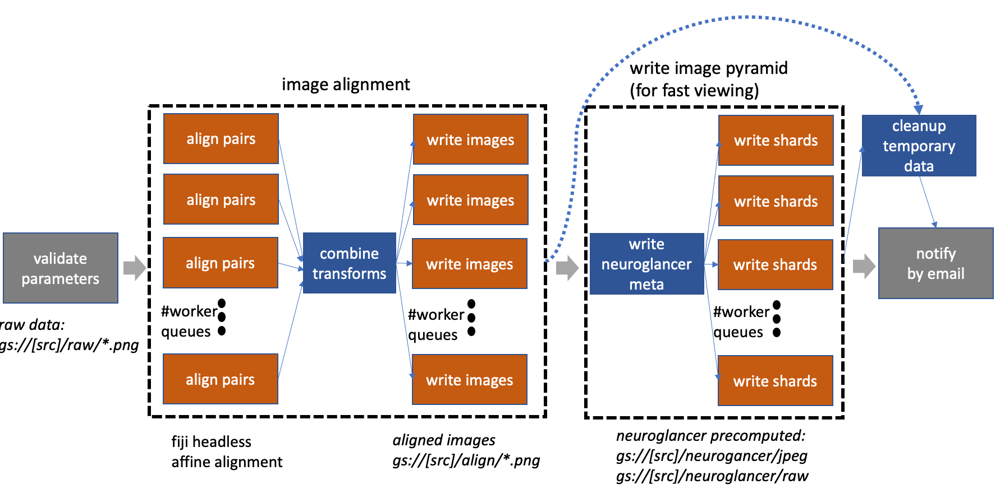

# clio_ingest

This package defines an Apache Airflow workflow to ingest and process data
collected by electron microscopy (EM).  The goal is to produce a push-button workflow
to handle smaller (but still computationally challenging) <10TB-sized datasets
 produced using high-quality FIB-SEM imaging.



Currently, the workflow aligns a stack of images and writes the scale pyramids
for fast, interactive viewing using the web-tool [neuroglancer](https://github.com/google/neuroglancer).
The major steps are higlighted in the image above.  The workflow is designed to work well with Google Composer, which is a managed Airflow
service and can be minimally provisioned.  The bulk of computation used by the workflow
leverages Google Cloud Run, which are stateless containers, where 100s can be spawned
in a "serverless" manner.

The documentation below explains how to install and use the service.  At the end, there is some discussion
on the underlying architecture and design decisions.

## Installation and configuration

The easiest way to use this workflow is to deploy to Google Composer (details below).  Google Composer
is a service that runs Apache Airflow that makes configuration very easy.  Furthermore, emprocess_workflow
requires access to google cloud storage (potential future work to support other storage solutions) making
integration easier if using Composer.
However, one can relatively easily install and manage Apache Airflow.  Since
most of the compute should leverage the Cloud Run containers for alignment and pyramid
generation, there is no significant performance advantage for deploying to Composer versus another
solution.

For local deployment, install "gcloud" from Google and ensure that the account is configured to
a Google project id with billable account information.

To install Airflow and related components

	% pip install airflow
	% pip install google_cloud_storage httplib2 google_auth_httplib2 google-api-python-client # to enable google drivers

The emprocess workflow calls web applications that perform alignment
and writing tasks.  The alignment is done using the fiji Docker container that can be hosted 
on Google Cloud Run (or run locally for testing).  See [fiji_cloudrun](https://github.com/janelia-flyem/fiji_cloudrun)
for instructions.  Similarly, the writing of aligned EM data and scale pyramids
is done by the emwrite container, instructions in this package under emwrite_docker/.

To launch the server on localhost:8080 and scheduler:

	% airflow webserver -p 8080
	% airflow scheduler

By navigating to localhost:8080, one can see a dashboard with several example DAG workfows.
Several variables must be set to enable the emprocessing DAG to be executed.

* Under Admin->Connections create ALIGN_CLOUD_RUN conn_id pointing to the http server running fiji
* Under Admin->Connections create IMG_WRITE conn_id pointing to the http server running emwrite
* Under Admin->Pools create "http_requests" and set to 512 if using Google Cloud Run or the capacity
of whatever is serving the alignment and writing web services.
* Setup email to enable Airflow to send notifications.
Modfiy the airflow.cfg "smtp" section by setting smtp_user and smtp_password.  For example, to use
your gmail address, set smtp_host to "smtp.gmail.com" and set "smtp_password" to the key
retrieved using [https://security.google.com/settings/security/apppasswords](https://security.google.com/settings/security/apppasswords).  Since this puts the key in a plain text file, it might not be the most secure
solution.  For information on how to do this on Google Cloud Composer, see [https://cloud.google.com/composer/docs/how-to/managing/creating#notification](https://cloud.google.com/composer/docs/how-to/managing/creating#notification). 
* Set core.dag_concurrency to 512 to allow 512 tasks to run in parallel for a DAG.  Set core.parallelism to 1024 (some large number for concurrency allowed over all DAGs).  Set scheduler.max_threads=4 to enable the scheduler to run a little faster. (Composer only) Set celery.worker_concurrency to 24 (or 6 times number of cores per node).  

Apache Airflow polls the "dag" directory periodically, updating the workflows available for scheduling.
Copy emprocess.py and ./emprocess to the AIRFLOW_DIR/dags/.  emprocess.py actually creates several workflows
using a different number of worker queues (discussed below).  By default, Composer activates any uploaded workflow.  For a local instance, the specific DAG must be activated, which can be done through the web UI.  The configurations
for a given "dag run" is given via command line json arguments described below.

### Google Composer deployment

Deploying this application on Google Composer is straightforward if the user already has a google
cloud project account.  Creating a new environment can be done easily by following the instructions
in [https://cloud.google.com/composer/docs/quickstart](https://cloud.google.com/composer/docs/quickstart).
If using Google, one can use a simple formula of 6 workers possible per core.  A configuration of 3 nodes
with 4 cores each will enable 24 cores per node 72 concurrent processes.  If more is needed, a larger
cluster can be created by expanding the GKE cluster.  
Once created, the settings should be configured as described above.  Composer allows users to interact
with the environment using the familiar Airflow web browser.  Environment variables can be set 
through the Composer UI.  emprocess.py file and ./emprocess directory can be uploaded to a cloud bucket associated
under the Composer DAGs folder.

Airflow in Google Composer can be accessed via a user terminal command line by prepending an airflow
command with the following:

	% gcloud composer environments run [name of environment] --location [location] [airflow arguments]

## Testing local install

After installing locally, one can verify that the workflow parses properly by running

	% python emprocess.py

This does not execute the operations but builds the graph and its dependencies.  If this fails,
Airflow will not be able to create a workflow DAG corresponding to this file.

To test the installation, the following can be run locally without requiring cloud run
functions or source data.

Pass the following --conf parameter string to the airflow command line.

```json
{
	"id": "sample",
	"image": "img%05d.png",
	"minz": 0,
	"maxz": 10,
	"source": "sample_bucket", 
	"project": "flyem-private",
	"email": "someaddress"
}
```

To avoid Google Cloud Storage during the test, SET the environment
AIRFLOW_TEST_MODE to anything (unset when starting production work).

Instead of launching the fiji and emwrite dockers, use a simple
moc server.py, which will start on localhost:9000 and set ALIGN_CLOUD_RUN
and IMG_WRITE to point to it.

	% python moc_server.py

Once the em_processing workflow is enabled (using the Airflow web interface), a DAG execution
run can be performed using the following command-line.

	% airflow trigger_dag --run_id refactor1 --conf 'JSON_STRING_ABOVE' emprocessing_width1_sample_0.1

One can monitor progress through the web front-end.  Each task instance including its inputs, outputs, and logs
can be viewed.  Note: the default execution management is done with a sequential scheduler.  As such,
the example will run very slowly as only one task can run at a time and the scheduler takes several
seconds until a new task is picked up.  This is not a limitatioin of Airflow
in general but rather of this very simple scheduler.  It is also not a problem when using Google Composer.

## Running a workflow

To process a stack of EM images, the following needs to be done.

* load a set of PNG images to a storage bucket in the directory "raw" (GBUCKET/raw/\*.png)
* ensure that AIRFLOW_TEST_MODE is unset
* make sure that ALIGN_CLOUD_RUN and IMG_WRITE are set to point to the docker containers serving
fiji and emwrite applications.
* create a configuration to be passed in the command line with a name for the workflow ("id"), the image
name string format ("image"), the first image slice ("minz"), the last slice ("maxz"),
the gbucket source ("source"), the google project id ("project"), email address ("email"), downsampling
("downsample_factor") that should be done before alignment (images larger than 5kx5k might
cause a mem out requiring downsampling of 2x or 4x), and whether raw grayscale should be written
in neuroglancer format ("rawPyramid").  The configuration
below can be used for the iso.\* images found in the resources/ folder.

```json
{
	"id": "slice2", 
	"image": "iso.%05d.png",
	"minz": 3493, 
	"maxz": 3494, 
	"source": "SOME BUCKET",
	"project": "GCP PROJECT ID",
	"mail": "email address",
	"downsample_factor": 4,
	"rawPyramid": false
}
```

Note: a version number is appended to the workflow name: em_processing_[id]_[version].  Also,
several different workflows are created with different static widths (the width of the DAG cannot
be specified at runtime).  The example below is choosing something with the lowest currency (width=1).
When using Airlfow with the 3 nodes (4 cores each) it is probably best to run with width=64.
Much larger pipelines are more cumbersome for the scheduler to handler and are harder to visualize.

To run:

	% airflow trigger_dag -r test1 -c 'JSONSTRING ABOVE' emprocess_width1_0.1

The semantics are slightly different when triggering Airflow through Composer on the command line:

	% airflow trigger_dag -- emprocess_width64_0.1 --run_id test1 --conf 'JSON STRING' 

Once this workflow finishes, one can view the ingested data using neuroglancer.
To do this, the bucket must be publicly readable to be used by neuroglancer
for now (choose an obscure gbucket name if security is needed).  Go to the google
storage page in the Google cloud console and set permissions for allUsers to have 
viewer access.  Once this is done, the bucket must be configured to enable CORs
so that neuroglancer can access it.  First create the following json file (and call it
cors.json).

```json
[
    {
      "origin": ["*"],
      "responseHeader": ["Content-Length", "Content-Type", "Date", "Range", "Server", "Transfer-Encoding", "X-GUploader-UploadID", "X-Google-Trace"],
      "method": ["GET", "HEAD", "OPTIONS", "POST"],
      "maxAgeSeconds": 3600
    }
]
```
Then run:

	% gsutil cors set cors.json gs://[bucket name]

Navigate to [neuroglancer](https://neuroglancer-demo.appspot.com/) and point the source to precomputed://gs://[bucket name]/neuroglancer/jpeg.

## Architecture Description


### Why Airflow?

Apache Airflow was chosen to orchestrate the data processing for a few reasons.  Processing EM image data
for connectomics or other analysis requires several processing steps often with diverse
compute, communication, and memory requirements.  Airflow is well-designed
to manage a diversity of different types of compute or "operators" and provide for automatic
retries on failures.  It is a good substrate
to try to organize these diverse steps into a cogent execution model.  There are other tools that can
process data using multiple workers such as Spark and Google Dataflow; however, many of the operations
required in our pipeline are very simple, batch-oriented compute.  Furthermore, Airflow can call
these other technologies for parts of the pipeline that might better utilize those technology
stacks.  Finally, Airflow is well supported and documented and provides a good web UI for debugging
and analyzing workflow runs.  Since Airflow is a generic solution, it seemed more likely to be portable
in other cloud or compute environments.  When debugging a workflow in Airflow, one can easily manually rerun
individual tasks.  We chose Google Composer since it wraps
Apache Airflow in a way that makes deployment easy.

### Downsides

There are a few downsides to Airflow and the use of Google Composer.  The following elaborates on several
as it helped to guide design decisions.

Managing versioning in Airflow
seems a bit messy.  If a workflow changes, it is probably best to add the version number to the 
DAG name, so it is a distinctly named workflow.  There is not much dynamicism in the DAGs.  The DAGs
need to be parseable and created before execution of the DAG (DAG run).
One way to achieve this is by setting a variable in Airflow (it is generally non-ideal to require
DAG creation to use an external database as the DAG files are executed frequently).

Some of these Airflow design decisions are a reflection on the history of using Airflow to do
scheduled, repeatable 'cron' jobs (which can also be seen by the execution time variable that is required
even for manual, non-scheduled invocations).

An Airflow task runs on distinct Airflow workers, which are separate processes.  This means that
even very light-weight tasks (that are periodically polling a resource for instance), require over 100
MB.  If a workflow needs 100s of concurrent sensors, the cluster will need to be provisioned accordingly
despite the total amount of compute being very low.

Airflow has a concept of sub-graph which intuitively should encapsulate sub-DAGs of computation
that can be re-used or represent and distinct and closely related group of tasks.  However,
the implementation of sub-graphs is such that the sub-graph operator (entry point to the sub-graph)
runs on a separate worker for the duration of the sub-graph computation.  If that worker crashes for some
reason the whole sub-graph dies, which might lead to undesirable results.

Google Composer
does not offer a serverless solution, requiring at least 3 nodes to run Airflow.  It seems that with
the ability to use Cloud Run or a dynamic Kubernetes cluster, pre-allocation of compute would be
unnecessary.  A better solution would be an on-demand, light-weight
web service that is always available, which would be ideal from a costing point-of-view.
For now, however, if more compute is needed than 3 nodes, it is relatively easy to ramp-up and ramp-up down usinig the Google
Kubernetes Engine (GKE).

Airflow is designed to orchestrate different types of compute.  But the implementation for these
distinct operations are often in the Airflow application as well (encouraged by the diversity
of custom operators).  This mixture of implementation logic
and orchestration seems a little messy.  It is nicely argued [here](https://towardsdatascience.com/how-to-use-airflow-without-headaches-4e6e37e6c2bc), that a better paradigm would be to
only orhestrate docker operators or kubernetes pods which can then encapsulate all the logic distinctly.  It would also
allow users to not have to spend a lot of time understanding the myriad of operators available in Airflow.
This seems
like a reasonable approach except some tasks are just a lot more efficiently implemented with
custom operators and embedded logic.


### emprocess_workflow Design

The original implementation for emprocess workflow allowed dynamicism to be achieved by setting 
Airflow variables, which could be parsed and used to create a dataset-specific DAG based on the number
of images of the dataset.  Instead emprocess.py now creates several processing
workflows with different pipeline widths.  The width specifies the number of concurrent
batch workers that can run at once.  Each of these batch workers leverage serverless compute
(in the form of Google Cloud Run) via http calls.  Since these http calls are not compute intensive
and since Airflow processes are not light-weight, this package designs a custom operator
for batching multiple requests in a multi-threaded way per task.  This allows one to effectively
achieve much more concurrency than width=64 for instance.  However, there is a trade-off
in that even though fewer tasks are easier to schedule and manage at a high-level, there is not as
much granularity for debugging and restarting individual tasks that fail.

 emprocess.py also specifies a version number.  When large changes are made to the code, the user
should modify this number, which will automatically trigger a new set of workflows tagged with the new
version ID to be created.  Airflow keeps the runtime information for any previous DAG runs,
but in this way future invocations will be explicitly separated.  For debugging, it might be annoying
to examine old user data but not have the old DAG stored (which is no longer available when the version
number is updated).  One can set the variable core.store_serialized_dags = True and old DAGs
will be cached.

The high-level orchestration of tasks is shown in the figure above (details on the major components below).
In general, the code was designed to make each component (alignment and pyramid creation)
 a sub-dag in code design (each component
is included as a dependency to the main dag file) but without the sub-dag semantics given the
limitations mentioned above.  But it should be pretty straightforward to convert this to sub-dags
if improvements are made in future versions of Airflow.

The majority of compute is not run on the Airflow cluster but rather using the serverless
Cloud Run platform.  This seeems to combine several ideal features: 1) it can run in a generic
docker container separating logic from python code in the DAG, 2) it auto-scales from 0 to 1000
compute nodes, and 3) it is serverless, requiring no provisioning.  Cloud run functions
are used in alignment and in pyramid writing and executed in a multi-threaded way across
a fixed number of task workers as mentioned above. 

### Description of workflow components

The major components of the workflow are alignment and pyramid
image ingestion.  Future work includes adding contrast enhancement
and various deep learning components for segmentation and synapse
prediction and other feature extraction.

#### alignment with FIJI

A headless fiji script (documented in string format in emprocessing/fiji_script.py) is run between
pairs of adjacent images.  An alignment transformation is computed by fitting an affine
transformation using RANSAC over matched SIFT features.  If there is little deformation
in the transformation, a rigid, translation only transformation is favored (which
should help limit pathological alignment scenarios).  Once these
transforms are computed across all adjacent images, the results are combined and a global
bounding box is computed for the volume.  The images are then written to the "align"
directory along with the transformation matrices used.  Future work could make this more
robust by matching every other slice or to find large transformations as a mechanism
to screen for outliers.  This component also writes out temporary files (one per 2d image),
which encodes each image as an array of 1024x1024 tiles to enable fast pyramid
creation (see next step).

Because this alignment is run in 2GB limited VMs (via CloudRun), one must downsample very
large images to fit into memory.  In general downsampling to around ~5kx5k, should work. 

#### writing scale pyramid into neuroglancer precomputed format

The dataset is written to /neuroglancer/jpeg and neuroglancer/raw (optional) using
neuroglancer's [pre-computed sharded format](https://github.com/google/neuroglancer/blob/master/src/neuroglancer/datasource/precomputed/sharded.md#sharding-specification).  Each "shard" is a separate
file that encodes several small chunks which can be effienctly retrieved for interactive
viewing.  The purpose of the "shard" is to have very few files to make copying the dataset
fast, while still allowing fast indexing into small chunks when only needing parts
of the dataset.

This component pre-allocates several workers (depending on the width chosen)
that iterate through different
subvolumes of the dataset of size
1024x1024x1024.  The pyramid generation is simplified greatly by adjusting the shard
sizes to a subset of the downscale pyramid based on the 1024^3 subvolume.
This allow each worker to be completely independent of all the others.

1024^3 can be read efficiently from the temporary files computed in the previous step
by doing a range fetch to retrieve just the relevant 1024x1024 tile.  Note, that
with this strategy (assuming that 64^3 represents the smallest chunk unit size
recommended), it is not possible (without orchestrating multiple writers to the same file)
to have a scale level higher than 4 (where
0 is maximum resolution) unless an initial shard size over 1024 is used or more sophisticated
inter-process communication is employed.
